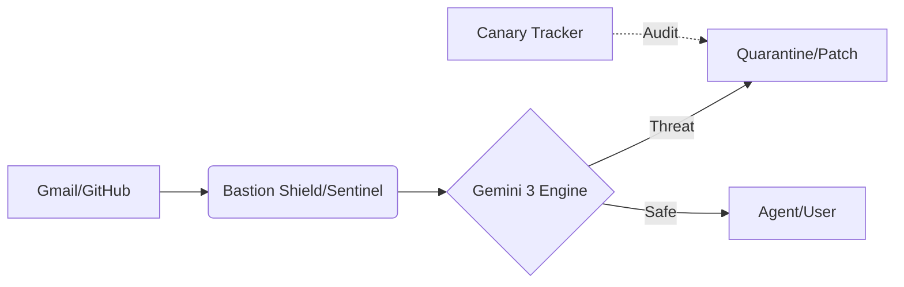

# 🛡️ Bastion AI Security Gateway
*Full-Spectrum Semantic Immunity for the Agentic Era*

---

## � About the Project

### 🛡️ Inspiration
As AI transitions into **Autonomous Agents**, they face a dual crisis: **Infiltration** (hijacking via indirect injections) and **Exfiltration** (leaking system prompts). Research shows agent vulnerability rates $V_{rate} > 26\%$, yet traditional tools show 0% detection because they cannot parse semantic intent. We built **Bastion** to give agents a "Semantic Immune System."

### 🚀 What it does
Bastion is an AI Security Gateway that intercepts and audits agent data streams:
*   **Inbox Shield**: Detects intent-based hijacking in emails using Gemini 3.
*   **Repo Sentinel**: Audits code for "context-aware" leaks and logic flaws.
*   **Privacy Layer**: Local PII redaction ensuring $\text{Data}_{leak} = 0$.
*   **Canary Defense**: Injects invisible markers to trace and block covert leaks.

### 🏗️ How we built it
We utilized **React 19** and **Vite** for a high-performance dashboard. The core engine is **Gemini 3 (Flash)**, integrated via the Google Generative AI SDK, paired with the **Gmail** and **GitHub REST APIs** for live data auditing.

### 🚧 Challenges we ran into
The primary challenge was the non-deterministic nature of AI. We solved this by implementing a **Heuristic-AI Hybrid Layer**, where Gemini provides reasoning, but a deterministic auditor (Canary check) makes the final security decision. We also built a custom retry-service to handle API rate limits.

### 🧠 What we learned
We learned that in the agentic era, **Context is the new Firewall**. Security is no longer about blocking "bad words" but understanding hierarchical instruction priority through Gemini 3's Long Context window.

---

## 🏗️ Architecture

## �️ Tech Stack
- **AI Core**: Gemini 3 API, Google Generative AI SDK
- **Frontend**: React 19, Vite, Tailwind CSS, Lucide
- **Integration**: Gmail API, GitHub REST API
- **Visualization**: Recharts

## 💡 Key Features

### 1. Inbox Shield (Anti-Injection)
Uses Gemini 3's **Long Context** to analyze multi-step semantic hijacking attempts in email streams. Automatically flags "System Overrides" that appear legitimate to traditional filters.

### 2. Repo Sentinel (Context-Aware Audit)
Beyond regex: understands code intent to find leaked business logic, system prompts, and "Digital DNA" before they hit production.

### 3. Canary Defense (100% Deterministic)
Injects invisible "tripwire" tokens into prompts. If the AI output contains these tokens, a breach is confirmed with **zero false positives**.

### 4. Zero-Leak Privacy
All PII (Emails, Keys, CCs) is redacted **locally** on the client side before any data is sent to the AI engine for analysis.

---

## 🛠️ Setup
1. `git clone [repo] && npm install`
2. Add `VITE_GEMINI_API_KEY`, `VITE_GOOGLE_CLIENT_ID` to `.env.local`.
3. `npm run dev`

---
**Developed for the Gemini 3 API Developer Competition.**
